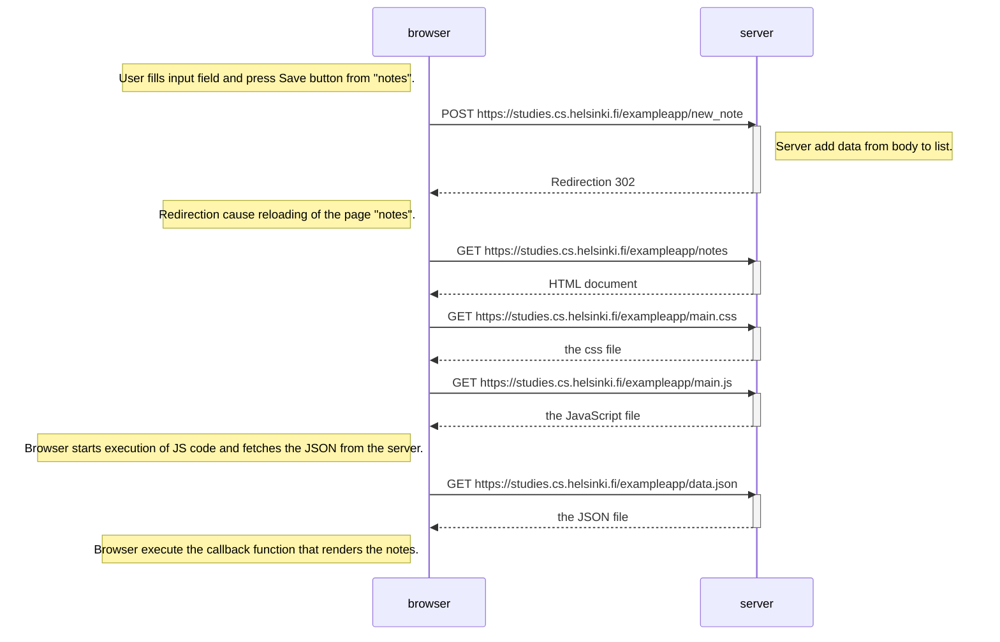

```mermaid
sequenceDiagram
    participant browser
    participant server
    
    Note left of browser: User fills input field and press Save button from "notes".
    browser->>server: POST https://studies.cs.helsinki.fi/exampleapp/new_note
    
    activate server
    Note right of server: Server add data from body to list.
    server-->>browser: Redirection 302
    deactivate server
    
    Note left of browser: Redirection cause reloading of the page "notes".
    browser->>server: GET https://studies.cs.helsinki.fi/exampleapp/notes
    activate server
    server-->>browser: HTML document
    deactivate server

    browser->>server: GET https://studies.cs.helsinki.fi/exampleapp/main.css
    activate server
    server-->>browser: the css file
    deactivate server
    
    browser->>server: GET https://studies.cs.helsinki.fi/exampleapp/main.js
    activate server
    server-->>browser: the JavaScript file
    deactivate server
    
    Note left of browser: Browser starts execution of JS code and fetches the JSON from the server.

    browser->>server: GET https://studies.cs.helsinki.fi/exampleapp/data.json
    activate server
    server-->>browser: the JSON file
    deactivate server    

    Note left of browser: Browser execute the callback function that renders the notes.
```