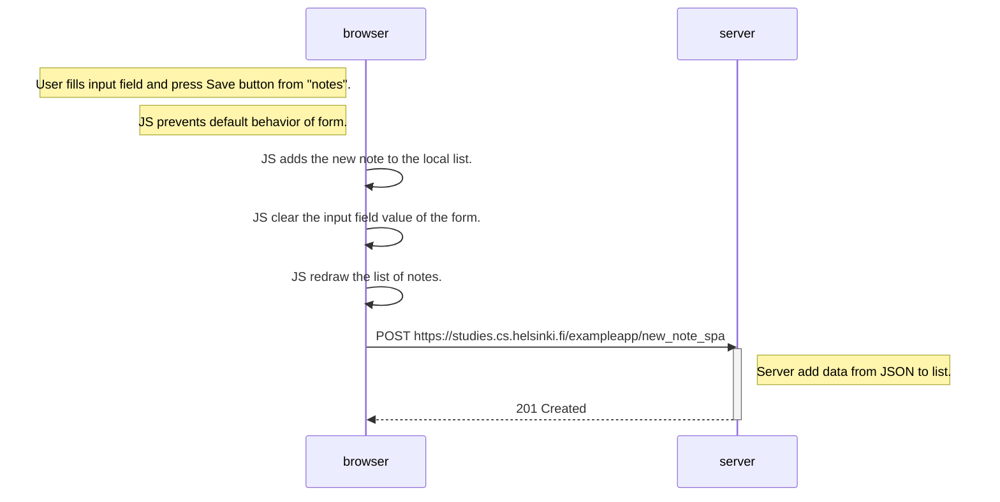

```mermaid
sequenceDiagram
    participant browser
    participant server
    
    Note left of browser: User fills input field and press Save button from "notes".
    Note left of browser: JS prevents default behavior of form.

    browser->>browser: JS adds the new note to the local list.
    browser->>browser: JS clear the input field value of the form.
    browser->>browser: JS redraw the list of notes.
    
    browser->>server: POST https://studies.cs.helsinki.fi/exampleapp/new_note_spa
    
    activate server
    Note right of server: Server add data from JSON to list.
    server-->>browser: 201 Created
    deactivate server
```